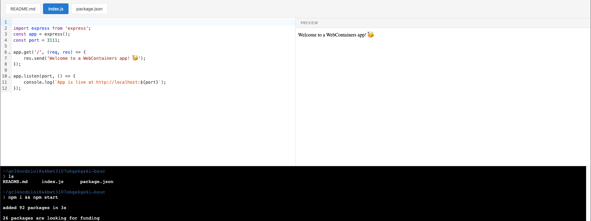

# CodeWrapper

A modular, framework-agnostic library for building interactive code editors and terminals in the browser. Built on top of [CodeMirror](https://codemirror.net/) for code editing and [xterm.js](https://xtermjs.org/) for terminal emulation, with optional [WebContainers](https://webcontainers.io/) integration for in-browser code execution.

## Features

- 🎨 **Code Editor** - Full-featured code editor powered by CodeMirror 6
- 💻 **Terminal** - Terminal emulation with xterm.js
- 🔧 **Fake Terminal** - Simulated terminal for custom command handling
- 🚀 **Code Execution** - Run Node.js code in the browser with WebContainers
- 📦 **Framework Agnostic** - Core package works with vanilla JavaScript and has adapters for popular web frameworks

## Packages

| Package | Description |
|---------|-------------|
| [`@codewrapper/core`](./packages/core) | Core functionality for code editor, terminal, and code execution |
| [`@codewrapper/react`](./packages/react) | React components and hooks |
| [`@codewrapper/vue`](./packages/vue) | Vue 3 components and composables |

See the individual package READMEs for installation and usage instructions.